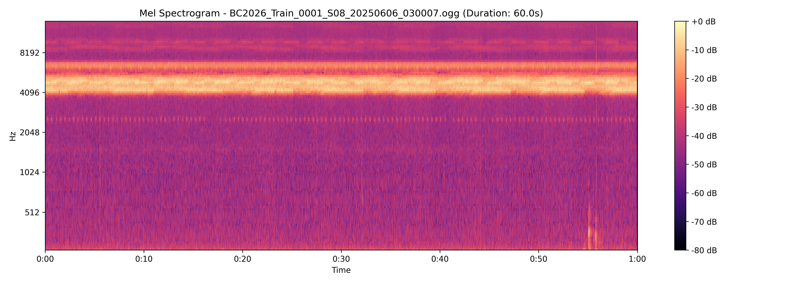
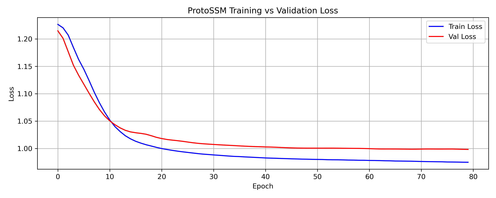
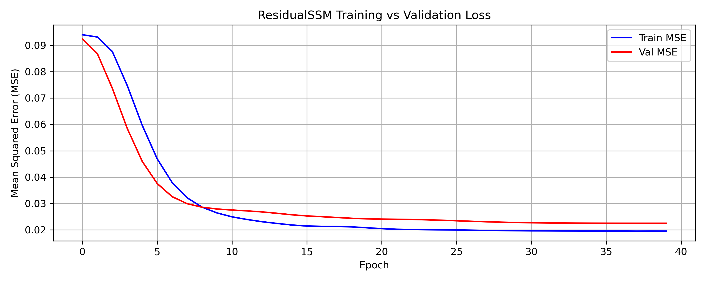

# BirdCLEF 2026 - Audio Vocalization Classification

This repository contains local training and validation workflows for the **BirdCLEF 2026 Competition**, focused on identifying bird species vocalizations in soundscape recordings from the Pantanal wetland in South America.

The solution utilizes Google's state-of-the-art **Perch v2 foundation model** as an ONNX feature extractor, combined with custom Prototype-based Selective State Space Models (**ProtoSSM**), class-frequency-weighted **MLP Probes**, and residual temporal correction (**ResidualSSM**).

---

## 📸 Visualizations

### 1. Mel-Spectrogram Extraction
A sample 60-second soundscape (`BC2026_Train_0001_S08_20250606_030007.ogg`) visualized using the project's audio configuration (sample rate: 32kHz, n_mels: 128, fmin: 50Hz, fmax: 14kHz):



### 2. Model Learning Curves
Training vs validation curves generated during local model training:

| ProtoSSM Loss Curve | ResidualSSM MSE Curve |
|:---:|:---:|
|  |  |

---

## 🛠️ Architecture Overview

The classification pipeline operates in four distinct phases:
1. **Perch Feature Cache:** Pre-computes 1536-dimensional sequence embeddings from the soundscape recordings using the Google Perch v2 ONNX backbone.
2. **ProtoSSM (Stage 1):** A light bidirectional Selective State Space Model that uses cross-attention layers and species prototype vectors to fuse raw sequential audio context with metadata (recorder location and UTC hour).
3. **MLP Probes (Stage 2):** Individual neural network probes trained for active species using class-frequency weighting to capture fine-grained local temporal dynamics.
4. **ResidualSSM (Stage 3):** A final Selective SSM trained to predict and correct errors (residuals) between the first-pass ensembled predictions and target ground truths.

---

## 🚀 Installation & Setup

Ensure you are using Python 3.10+ (Anaconda is recommended).

### 1. Clone the Repository
```bash
git clone <your-repo-url>
cd BirdClef
```

### 2. Install Dependencies
Install all required audio, deep learning, and serialization packages:
```bash
pip install torch torchvision onnxruntime kagglehub numpy pandas soundfile scikit-learn matplotlib tqdm joblib librosa
```

---

## 📁 Local Dataset Directory Structure

To run training locally, place the competition data files in the root folder according to the layout below (which is configured in `.gitignore` to prevent tracking large binaries):

```text
BirdClef/
├── train_audio/                  # Primary training audio directories (.ogg files)
├── train_soundscapes/            # Soundscape validation recordings (.ogg files)
├── test_soundscapes/             # Mock test recordings
├── train.csv                     # Species metadata
├── taxonomy.csv                  # Species taxonomic mapping
├── sample_submission.csv         # Format reference schema
├── train_soundscapes_labels.csv  # Window-level annotations
├── train_perchv2.py              # Main training script
├── precompute_mels.py            # Mel spectrogram compute utility
├── plot_mel.py                   # Plotting utility
└── README.md
```

---

## 💻 Usage Instructions

### 1. Training the Perch v2 Model
The training script will automatically download the Perch model checkpoints and labels from Kaggle via `kagglehub`, extract features, execute the training pipeline, and output checkpoints and plots to `birdclef2026_trained/`:

```bash
python train_perchv2.py
```

### 2. Plotting Mel-Spectrograms
To generate and view a spectrogram visualization of a specific soundscape audio recording, run:
```bash
python plot_mel.py
```

---

## 💾 Saved Checkpoints
After training completes, the weights and artifacts are saved to `birdclef2026_trained/`:
* `proto_ssm.pt` - Prototype SSM checkpoint
* `residual_ssm.pt` - Residual error corrector checkpoint
* `mlp_probes.joblib` - Trained MLP classifiers
* `prior_tables.joblib` - Location/time occurrence tables
* `thresholds.npy` - Calibrated per-class decision thresholds
* `meta.json` - Model hyperparameter definitions
